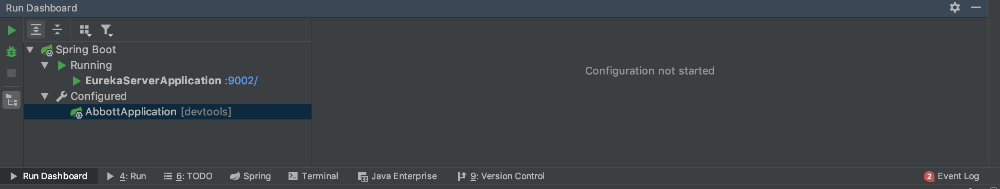
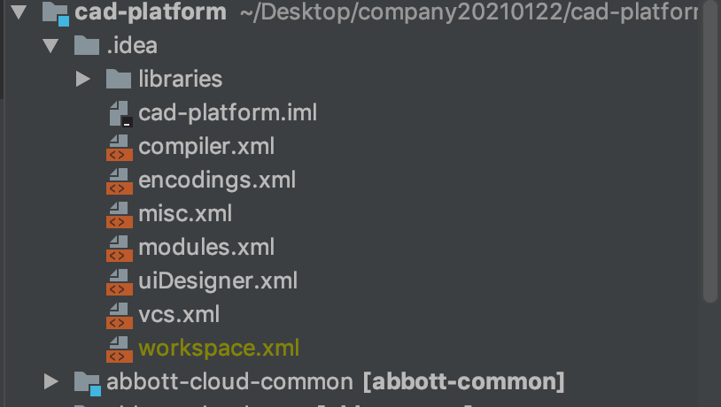
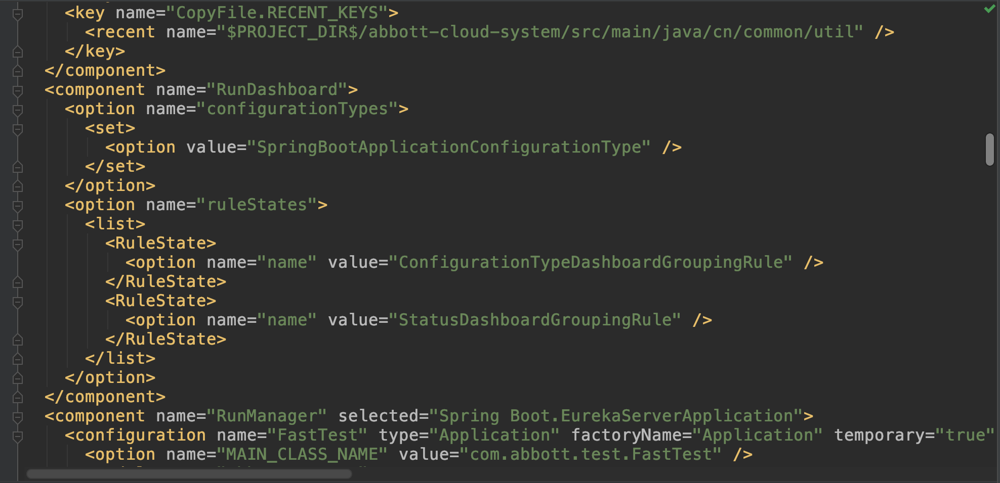

# 打开service服务窗口

如何在`IDEA`软件中打开 service 服务窗口，方便查看多个服务和端口


第一，找到项目的根目录，进入.idea文件夹，找到workspace.xml文件。



第二，将rundashboard文件修改为以下内容。


修改内容：

```

<component name="RunDashboard">
	<option name="configurationTypes">
		<set>
			<option value="SpringBootApplicationConfigurationType" />
		</set>
	</option>
	<option name="ruleStates">
		<list>
			<RuleState>
				<option name="name" value="ConfigurationTypeDashboardGroupingRule" />
			</RuleState>
			<RuleState>
				<option name="name" value="StatusDashboardGroupingRule" />
			</RuleState>
		</list>
	</option>
</component>
```

第三，重启IDEA软件，即可。